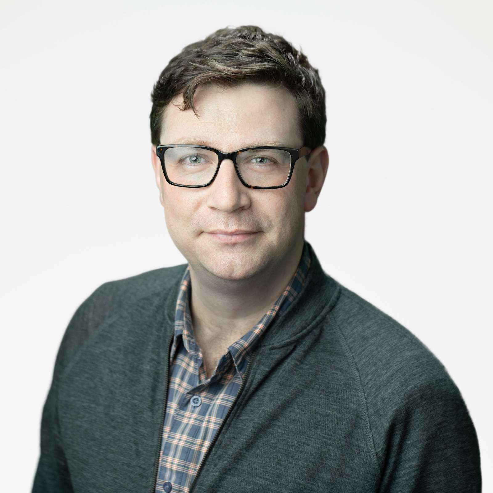

Dave Stanke (twitter: @davidstanke) is a Developer Relations Engineer for Google Cloud Platform, specializing in DevOps, Site Reliability Engineering (SRE), and other flavors of technical relationship therapy. He loves chatting with practitioners: listening to stories, telling stories, sharing a healthy cry. Prior to Google, he was the CTO of OvationTix/TheaterMania, a SaaS startup in the performing arts industry, where he specialized in feeding memory to Java servers. He chose on purpose to live in New Jersey, where he enjoys baking, indie rock, and fatherhood.

